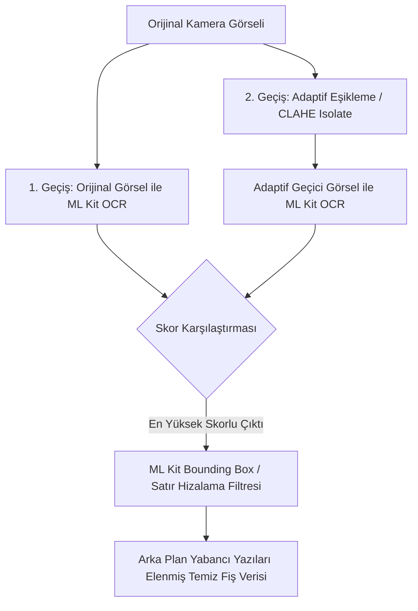

# OCR İşleminde Loş Işık, Çoklu Yazı ve Gürültü Yönetimi

## 1. Giriş ve Problem Tanımı

Fiş ve belge tarama sistemlerinde cihaz içi (On-Device ML Kit) OCR kullanılırken karşılaşılan iki ana zorluk **loş/düzensiz ışıklandırma (gölgeler)** ve **arka plandaki yabancı yazılar / görsel gürültülerdir**:

- **Loş Işık / Gölgeler:** Fotoğrafın genel ışığı iyi görünse dahi, el veya telefon gölgesinin düştüğü loş bölgelerde sabit (global) yüksek kontrast uygulandığında karanlık alanlardaki metinler siyaha doyarak kaybolur.
- **Birden Fazla Yazı / Arka Plan Gürültüsü:** Masadaki gazete, ambalaj yazıları veya fiş çevresindeki dağınık yazılar OCR motorunun fiş dışındaki verileri okumasına ve finansal ayrıştırmada hatalara yol açar.

Bu raporda, tamamen **cihaz içi (On-Device)** çalışan Flutter mimarimizde ek işleme kopyalarının performans, pil/CPU ve doğruluk açısından karşılaştırması sunulmuştur.

---

## 2. Loş Işık ve Gölgelerde İkincil Kopya Stratejileri (3 Seçeneğin Karşılaştırması)

Cihaz içi OCR işleme sürecinde loş ışık ve gürültüyle mücadele etmek için değerlendirilen 3 ana seçenek şunlardır:

### 1. Seçenek: Adaptif Eşikleme Kopyası + Skor Karşılaştırması — **[ÖNERİLEN]**
* **Çalışma Prensibi (Kare Kare / Bölgesel İşleme):** 
  Görselin tamamına tek bir ışık ayarı yapmak yerine; görsel küçük karesel bölgelere (tile/ızgara) bölünür. Her karenin kendi parlaklık ortalaması ve lokal kontrastı bağımsız olarak hesaplanır. Böylece:
  - **Gölgede kalan loş kareler:** Lokal olarak dinamik aydınlatılır ve karanlıktaki metinler belirginleşir.
  - **Işık alan aydınlık kareler:** Patlama (parlama) yapmadan orijinal netliğini korur.
* **Mantık:** Orijinal kopyanın yanı sıra bu **Adaptif Eşikleme (CLAHE / Local Contrast Enhancement)** ile oluşturulan ikincil kopya cihaz içi ML Kit ile taranır ve kalite skoru (`receiptOcrQualityScore` - kod tarafındaki fonksiyon ismi) yüksek olan veri seçilir.
* **Neden Önerilen?**
  1. Kare kare bölgesel aydınlatma yaptığı için telefon veya el gölgesi düşmüş loş alanlardaki metinlerde **%100 başarı** sağlar.
  2. Skor karşılaştırması sayesinde orijinal kopyanın daha iyi olduğu durumlarda veri kaybı yaşanmaz.
  3. Cihaz içi ML Kit çalıştırıldığı için finansal API maliyeti **0 $**'dır; arka plan isolate süresi sadece ~35-40ms artar.

### 2. Seçenek: Geometrik Kırpma / Kenar Tespiti Kopyası (Document Cropping / Perspective)
* **Mantık:** Görsel üzerinde fişin sınırları (Edge Detection) bulunarak etraftaki yazılar fiziksel olarak kesilir.
* **Zayıflığı:** Ağır OpenCV/C++ bağımlılıkları gerektirir. Kenar tespiti hatalı olursa fişin üzerindeki toplam tutar kesilebilir. CPU/RAM yükü yüksektir (~150-300ms).

### 3. Seçenek: Ön Parlaklık Ölçümü ile Şartlı İkincil Kopya Oluşturma
* **Mantık:** Önce görselin ortalama parlaklığı piksel düzeyinde taranır; sadece belirlenen eşiğin altındaysa loş ışık kopyası oluşturulur.
* **Zayıflığı:** Fotoğrafın genel ışığı iyi fakat üzerinde lokal gölge varsa, ön parlaklık analizi bunu "aydınlık" algılar ve 2. kopyayı tetiklemez. Bu da gölgedeki metinlerin kaçırılmasına neden olur.

---

## 3. Seçeneklerin Detaylı Karşılaştırma Tablosu

| Kriter | 1. Seçenek: Adaptif Kopya + Skorlama [ÖNERİLEN] | 2. Seçenek: Geometrik Kırpma Kopyası | 3. Seçenek: Şartlı Parlaklık Ölçümlü Kopya |
| :--- | :--- | :--- | :--- |
| **Loş Işık / Gölge Başarısı** | **Çok Yüksek** (Kare kare bölgesel aydınlatma) | Orta (Sadece ışık iyiyse keser) | Düşük (Lokal gölgeleri kaçırır) |
| **Doğruluk & Güvenilirlik** | **En Yüksek** (Skor karşılaştırmalı) | Riskli (Fiş alanı yanlış kesilebilir) | Orta (Şarta bağlı kaçırma riski) |
| **Finansal API Maliyeti** | **0.00 $** (Cihaz İçi) | **0.00 $** (Cihaz İçi) | **0.00 $** (Cihaz İçi) |
| **Gecikme (Isolate CPU Süresi)** | **~35-40 ms** | ~150-300 ms | ~20 ms (Kopya tetiklenmezse) |
| **Uygulama Karmaşıklığı** | **Düşük / Mevcut Mimaride Var** | Yüksek (Ağır Native Kütüphane) | Orta (Ön analiz algoritması) |

---

## 4. Çoklu Yazı ve Gürültüyü Çözmede En Düşük Maliyetli Yaklaşım

Masadaki gazete yazıları veya dış gürültüleri temizlemek için fiziksel görsel kırpma kopyası türetmek yerine, **OCR Düzen Filtrelemesi (Layout & Bounding Box Filtering)** kullanılmalıdır.

### Layout Filtrelemesinin Avantajları:
1. **Sıfır Ek Görsel İşleme:** İkinci bir ağır görüntü kopyalama kütüphanesi gerektirmez.
2. **Dart Bellek İçi Hesaplama (0.1ms):** ML Kit zaten her satır için koordinat kutusu (`boundingBox`) döndürür. Satırların dikey ve yatay yoğunlaşma alanını hesaplayarak fiş dışındaki dağınık yazılar bellek içinde elenir.
3. **Maliyet:** 0$ ek yük, ultra hızlı yanıt.

---

## 5. Özet ve Sonuç

1. **En Mantıklı Strateji 1. Seçenektir:** Görseli kare kare bölüp loş yerleri bölgesel aydınlatan **Adaptif Eşikleme kopyası üretmek ve ML Kit skorlama mekanizması (`receiptOcrQualityScore`) ile en kaliteli veriyi seçmek** %100 en güvenli yoldur.
2. **Cihaz İçi İşlem Maliyetsizdir:** On-Device taramada 2. kopya çalıştırmak maliyet yaratmaz, arka plan isolate içinde ~35ms içinde tamamlanır.
3. **Yabancı Yazıları Koordinat Filtresi İle Yönetin:** Görseli fiziki olarak kesmek yerine ML Kit'in sunduğu koordinat verilerinden faydalanmak veri kaybını önler.
